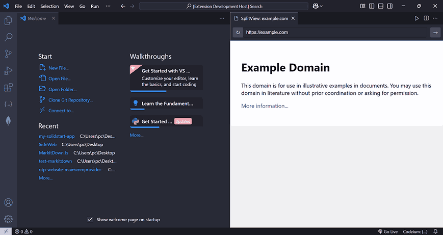

# SplitView

A simple VS Code extension that lets you open a webview right inside your editor. Perfect for testing your web apps without switching away from VS Code.

## Features

- **Browser in your editor**: View websites in a split editor view
- **Simple navigation**: URL bar and refresh button just like a real browser
- **Responsive design**: Automatically adjusts to fit your editor's size

## How to Use

1. Open the command palette (`Ctrl+Shift+P` or `Cmd+Shift+P`)
2. Type "SplitView: Open Web Preview" and hit Enter
3. Type any URL in the address bar and hit Enter to navigate

## Known Issues

- Some websites with strict security policies might not load in the iframe
- Websites which do not exist may not load in iframe
- No support for browser extensions or cookies across sessions
- No support for some window APIs like alert, prompt etc.

## Privacy

This extension doesn't collect any data. All browsing happens locally in your VS Code instance.

## Need Help?

If you find bugs or have ideas for new features, please [open an issue](https://github.com/Mirza-Glitch/split-view-vscode-extension/issues/new) on GitHub.

---

Made with ☕ by a developer who got tired of switching from vscode
